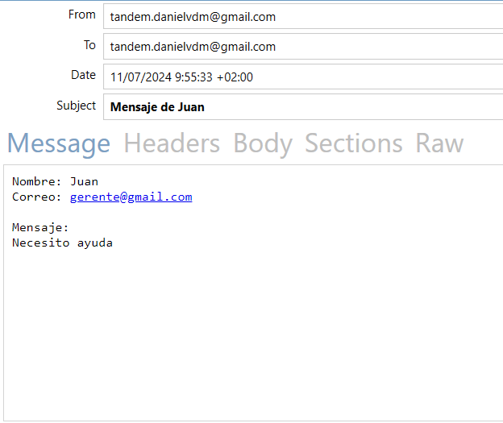

# Contacto Formulario PHP

 + **Descripción:**

Este script PHP permite procesar formularios de contacto enviados a través de una solicitud POST con formato JSON. Recibe el nombre, email y mensaje del usuario, los valida y envía un correo electrónico al destinatario configurado.

+ **Instalación:**

Suba la carpeta *api-cristinabecerra* a su servidor web.
Modifique el correo del archivo index.php (linea 7) y ponga su correo

+ **Uso:**

Abra el archivo *send-mail.http* y rellena los campos:
1. name: Nombre del usuario (requerido)
2. email: Correo electrónico del usuario (requerido, formato válido)
3. message: Mensaje del usuario (requerido)

+ **Ejemplo:**

Esto respondera su consulta si se ha enviado correctamente:

{
    "name": "Juan",
    "email": "gerente@gmail.com",
    "message": "Necesito ayuda" 
}

{
  "status": "success",
  "message": "Correo enviado correctamente."
}

